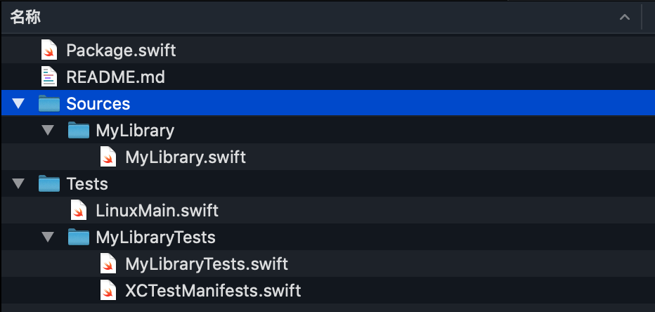

# Creating Swift Packages
 

## 为什么有Swift PM
任何现代语言都有自己的官方依赖管理系统，苹果打算用Swift PM来取代CocoaPods和Carthage，SwiftPM能更好在团队和开源社区分享代码，具有如下优势：

- Swift跨平台构建系统
- 苹果官方包管理工具
- 代码复用最大化
- 包含在SWift工具链和Xcode中

## Swift PM 4个基本命令
- Swift package 创建、编辑、更新和重置等包操作
- Swift build 编译源代码生成二进制product
- Swift test 运行包中所有单元测试
- Swift run 运行可执行product


## 创建本地Package [Library]
通过下面命令行创建 ‘MyLibrary’Package

```
$ mkdir MyLibrary
$ cd MyLibrary
$ swift package init -- type=library
$ swift build
$ swift test
```
查看Mylibrary目录内容如下：

- README.md 描述包具有功能
- Package.swift 包清单文件，描述包配置。定义包name、platforms、product、target和dependencies
- Source里面包含多个target，即每个单独子文件夹都是一个target
- Tests里面包含多个test targe，即每个单独子文件夹都是一个test target


## 发布Packages
添加Git仓库中，打tag并推送到github

```
$ git init
$ git add .
$ git commit -m "publishing Swit Package"
$ git remote add origin [github URL]
$ git push origin master
$ git tag 1.0.0
$ git push origin 1.0.0
```

### Package语义版本
版本遵守这些原则（如1.0.0三位分别对应major、min、patch）

- major：不兼容API修改
- min：向下兼容增加功能和附带修复bug
- patch：向下兼容修复bug


## Package manifest API
Package.swift清单文件内容：

```
// swift-tools-version:5.1
// The swift-tools-version declares the minimum version of Swift required to build this package.

import PackageDescription

let package = Package(
    name: "MyLibrary",
    platforms: [
        .macOS(.v10_13), .iOS(.v11), .tvOS(.v11),
    ],
    products: [
        // Products define the executables and libraries produced by a package, and make them visible to other packages.
        .library(
            name: "MyLibrary",
            targets: ["MyLibrary"]),
    ],
    dependencies: [
        // Dependencies declare other packages that this package depends on.
        // .package(url: /* package url */, from: "1.0.0"),
         .package(url: "https://github.com/jpsim/Yams", .upToNextMajor(from: "2.0.0"))
    ],
    targets: [
        // Targets are the basic building blocks of a package. A target can define a module or a test suite.
        // Targets can depend on other targets in this package, and on products in packages which this package depends on.
        .target(
            name: "MyLibrary",
            dependencies: []),
        .testTarget(
            name: "MyLibraryTests",
            dependencies: ["MyLibrary"]),
    ]
)

```

- swift-tools-version描述支持swift tool和PackageDescription library最低版本
- name 包名
- platforms 定义部署target支持平台最低版本
- dependencies 依赖其他第三方包
- targets：一组源文件构成模块


## 未来特性
- 支持资源，如图片、文本和其他data类型


## Q&A
 

## 引用
- [Creating Swift Packages](https://developer.apple.com/videos/play/wwdc2019/410/)
- [Apple Swift Package Manager: A Deep Dive](https://medium.com/xcblog/apple-swift-package-manager-a-deep-dive-ebe6909a5284)
- [Swift Package Manager Guide – the time to shine is now!](https://tsh.io/blog/swift-package-manager-for-ios-new-features/)
- [Swift Package Manager Guide – making a modular iOS app](https://tsh.io/blog/swift-package-manager-modules-and-packages/)

 


