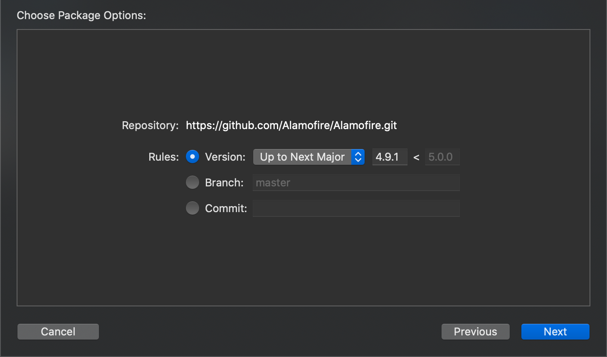
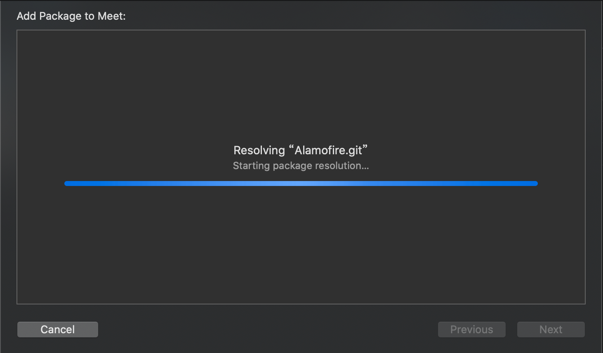
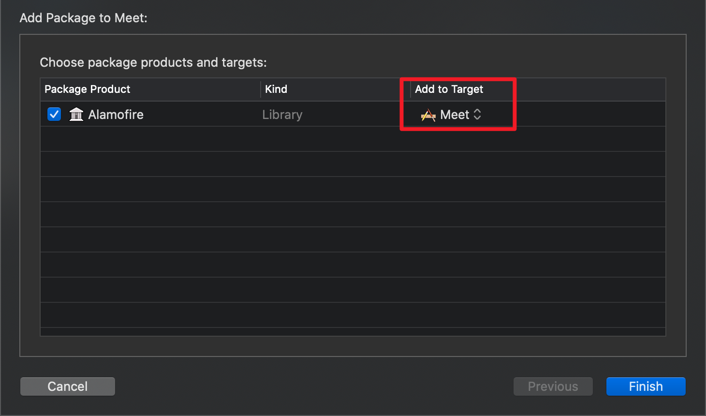
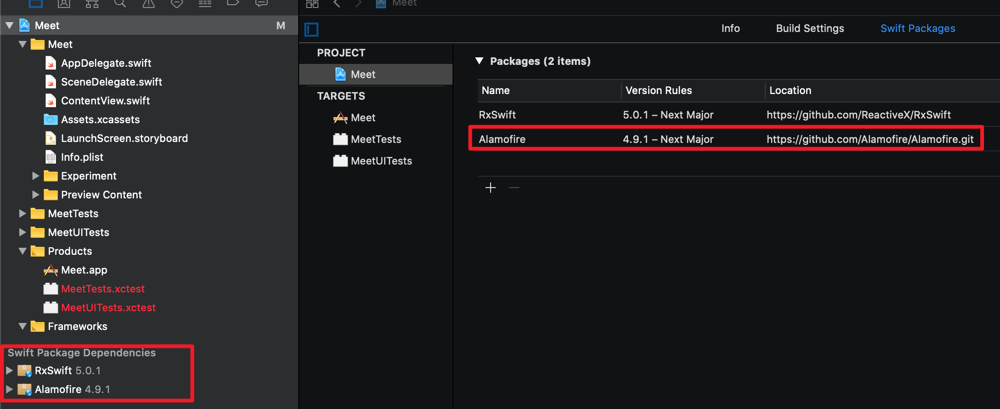

# 如何在工程中使用SwiftPackageManager
随着2019/09 Xcode11的发布，Swift Package Manager开始对IOS、TVOS和WatchOS全面支持，可以正式取代Cocoapods和Carthage来管理第三方库依赖。

## Swift Package Manager是什么
Swift Package Manager（Swift 包管理器，一般简称SPM）是苹果官方提供的一个用于管理源代码分发的工具，旨在使分享代码和复用其他人的代码变得更加容易。该工具提供编译、链接Swift package、管理依赖关系、版本控制，以及支持灵活分发和协作。

## 必备条件
- XCode 11.0+

## 开始
通过下面步骤来演示如何在工程里面引入流行的第三方http开源库Alamofire

1. 在Xcode导航中 `file` -> `Swift Packages` -> `Add Package Dependency`
 
 

2. 选择alamofire 包版本`Choose Package Options` 
3. 添加包到工程 
4. 添加包到target 
5. 项目导航中项目依赖 

## Q&A
### 如何协同开发者保持引入第三方包版本一致
其实通过`project.xcworkspace/xcshareddata/swiftpm/Package.resolved`来保持，这个文件务必要提交上去。

## 引用
- [Swift Package Manager](https://github.com/apple/swift-package-manager/tree/master/Documentation)
- [Adopting Swift Packages in Xcode](https://developer.apple.com/videos/play/wwdc2019/408/?time=1130)

