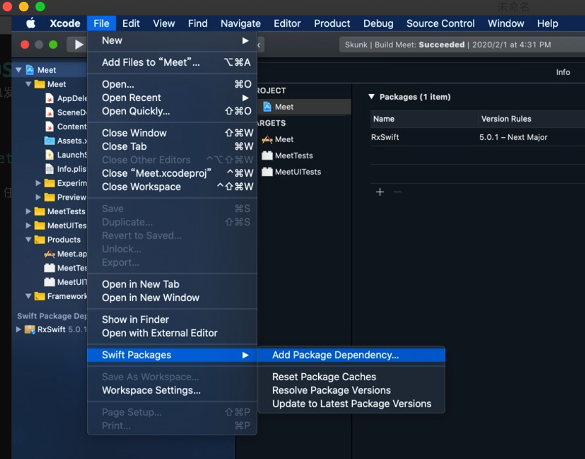

# IOS Project Swift Package Manager
Xcode11发布以后，SWiftPM已支持IOS，下面给出一个demo如何给App添加Alamofire

### Get Start
- 在Xcode导航中 `file` -> `Swift Packages` -> `Add Package Dependency`
 
 
 

- [x]  `- + 空格 + [x]`

